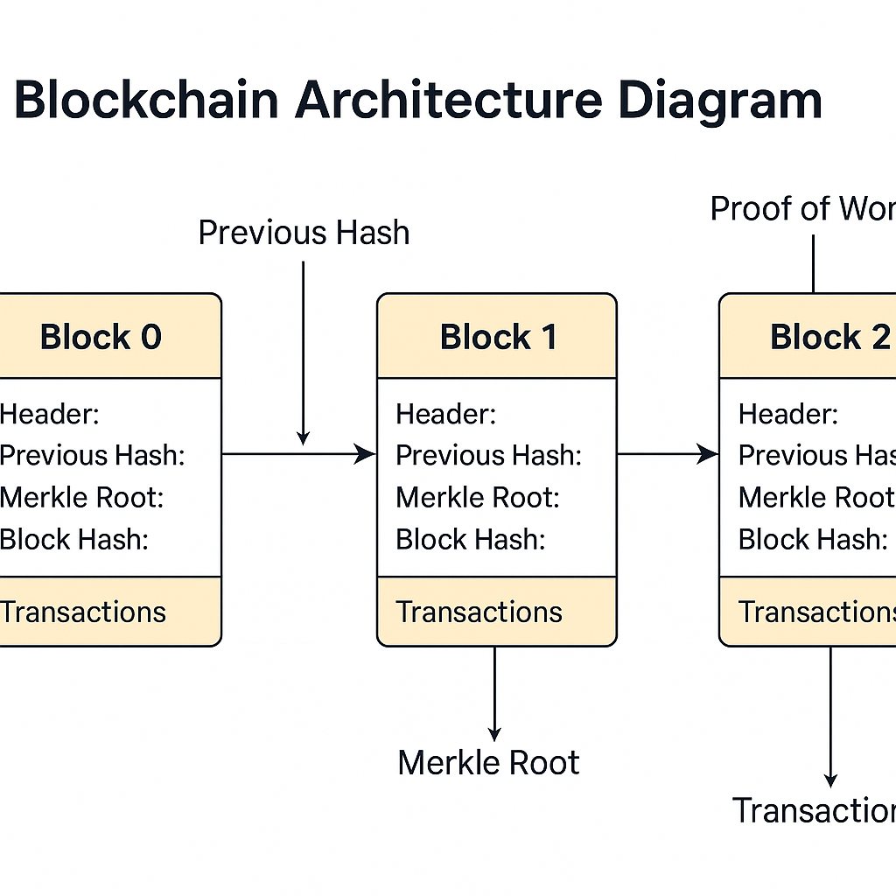

# 🧱 Python Blockchain Prototype


A clean, lightweight, and fully educational blockchain implementation in Python  including Proof-of-Work, Merkle Roots, Block Validation, and a complete demonstration script.

---

## 🚀 Overview

This repository introduces the fundamental mechanics behind blockchain technology through a minimal and readable Python implementation.

It demonstrates:

- Block construction and hashing  
- Proof-of-Work mining  
- Merkle root computation  
- Blockchain validation  
- Transaction formatting  
- Genesis block creation  
- Fully runnable demo  

Perfect for **students**, **researchers**, and **developers** who want to understand how blockchains work internally.

---

## 🧱 Features

### ✔️ Genesis Block
Automatically generated with a system reward transaction.

### ✔️ Proof-of-Work (PoW)
Mining requires the block hash to begin with `000…` depending on the difficulty level.

### ✔️ Merkle Root Integrity
Ensures transaction integrity through SHA-256 based Merkle tree construction.

### ✔️ Blockchain Validation
Validates:
- Previous hash linkage  
- Merkle root correctness  
- Hash and PoW integrity  

### ✔️ Demonstration Script
Generates addresses, builds transactions, mines blocks, and validates the full chain.

---

## 📁 Project Structure

````
/project
│
├── block.py        # Block structure, hashing, mining, Merkle root
├── blockchain.py   # Blockchain class, block linking, validation
└── main.py         # Demo execution script

````

---

## 🖼️ Architecture Diagram

Below is a conceptual visualization of the architecture used in the project:




---

## 🧩 How It Works

### 🧊 Block Structure

A block contains:

```json
{
  "index": 1,
  "timestamp": 1732039801.55,
  "transactions": [...],
  "previous_hash": "af2391...",
  "nonce": 5023,
  "merkle_root": "b82391...",
  "hash": "000f12a..."
}
````

### ⛏️ Proof-of-Work Mining

A block is valid if:

```
hash(block_header).startswith("0" * difficulty)
```

### 🌳 Merkle Root Computation

* Every transaction is hashed
* Hashes are paired and hashed again
* This repeats until one root remains

---

## ▶️ Running the Demo

### 1. Clone the Repository

```bash
git clone https://github.com/benyoudz/mini_blockchain.git
cd mini_blockchain
```

### 2. Run the Script

```bash
python3 main.py
```

### 3. Output Includes:

* Mined blocks
* Nonce values
* Block hashes
* Merkle roots
* Full blockchain validation

---

## 🔧 Customization

You can extend this codebase by adding:

* ECDSA digital signatures
* Wallet & keypair system
* Transaction objects with metadata
* UTXO or account-based model
* Flask/FastAPI API
* Networking between nodes
* Consensus algorithms (PoS, PBFT, Raft)
* Database persistence

---

## 📌 Why This Project?

This project is:

* **Educational:** ideal for courses, lectures, tutorials
* **Readable:** clean Python OOP structure
* **Extendable:** easy to build real blockchain features
* **Practical:** includes mining, hashing, validation

---

## 👤 Author

**Benyamina Youcef**
Full-Stack Developer & AI Engineer
📍 Algeria

---

## 📜 License

This project is licensed under the **MIT License**.
You are free to use, modify, and distribute it.


---

```
